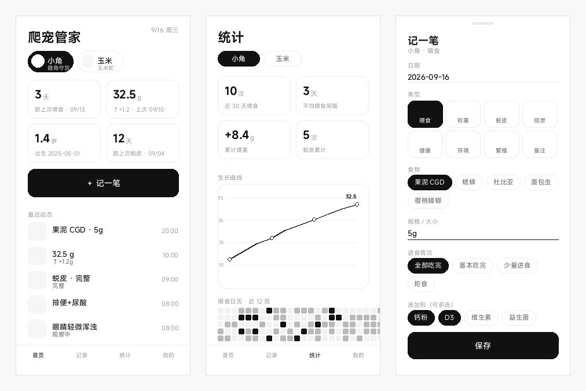

# 爬宠管家 · Reptile Care

> 给爬行动物饲养者的一本「活」台账。记录喂食、称重、蜕皮、排泄与健康，自动生成生长曲线和喂食日历。
>
> 单个 HTML 文件，零依赖，零联网，数据全部留在你自己手机里。

**许可：CC BY-NC-SA 4.0 —— 个人免费使用，禁止一切商业用途。**

  

 

  

 

## 为什么做这个

养爬宠最怕的不是麻烦，是**记不住**。

上次什么时候喂的？这周吃了几次？体重是不是半个月没动了？上次蜕皮到现在多久了？这些问题靠脑子记，等到发现异常往往已经晚了。

市面上的宠物 App 大多是为猫狗设计的，爬宠的喂食间隔、乳鼠规格、蜕皮周期、温湿度这些关键指标无处安放。这个应用就是为这些需求做的：

- **3 秒记一条**，不用填一堆表单
- **一眼看到异常**：距上次喂食天数超标会标红
- **曲线比数字有用**：体重趋势一目了然，掉秤能第一时间发现

## 功能

### 记录

| 类型 | 记录内容 |
|---|---|
| 🍽 喂食 | 食物种类、规格、进食情况、添加剂 |
| ⚖️ 称重 | 体重（g）、体长 / SVL（cm） |
| 🌀 蜕皮 | 是否完整、残留部位 |
| 💧 排泄 | 排便 / 尿酸、形态是否正常 |
| 🩺 健康 | 症状、用药、是否就医 |
| 🌡 环境 | 热点温度、冷区温度、湿度 |
| 🥚 繁殖 | 交配、产卵、孵化、拒食期 |
| 📝 备注 | 任何想记的事 |

### 统计

- **生长曲线**：体重 / 体长切换，自动标注最新值
- **喂食日历**：近 12 周热力图，一眼看出喂食是否规律
- **食物构成**：近 30 天各类食物的占比
- **关键指标**：近 30 天喂食次数、平均间隔、累计增重、蜕皮累计

### 其它

- 多宠物管理，顶部一键切换
- 按物种预置食物选项（睫角守宫给果泥，玉米蛇给乳鼠分级）
- 可设每只宠物的目标喂食间隔，超期标红提醒
- 首页备份提醒，超过 14 天未备份会提示
- 导出 / 导入 JSON 备份，导出 CSV 表格
- 宠物头像（自动压缩到 160×160）

## 快速开始

### 方式一：直接用（最省事）

下载 `index.html`，双击用浏览器打开即可。也可以传到手机，用 Chrome（iPhone 用 Safari）打开。

适合先试玩。缺点是无法安装成桌面 App、无离线缓存。

### 方式二：部署为 PWA（推荐）

部署后手机访问网址即可「安装应用」，获得**桌面图标、全屏无地址栏、断网可用**的完整体验。

1. GitHub 新建公开仓库
2. 上传仓库内的全部文件（`index.html` 必须在根目录）
3. Settings → Pages → Source 选 `Deploy from a branch` → 分支 `main`、目录 `/ (root)` → Save
4. 等 1~3 分钟，访问 `https://你的用户名.github.io/仓库名/`

**安装到手机**

- **Android（Chrome）**：右上角 `⋮` → 安装应用 / 添加到主屏幕
- **iPhone（Safari）**：底部分享按钮 → 添加到主屏幕

> 详细的部署说明、Vercel / Netlify / Gitee Pages 替代方案、常见问题见 `部署说明.md`。

## 数据安全

**所有数据都存在你自己的浏览器里，应用不发任何网络请求**，GitHub 只负责分发文件。

但浏览器本地存储并非绝对可靠，这个应用做了三层防护：

1. **持久化存储申请**：首次打开自动申请 `persistent storage`，获批后手机存储紧张时系统会优先保留本应用数据
2. **备份提醒**：记录满 3 条后，从未备份或超 14 天未备份时首页提示
3. **导出 / 导入**：JSON 完整备份，换机恢复只需一次导入

### 你需要做的

- **每两周导出一次 JSON**，存网盘或发给自己。这是唯一 100% 可靠的方案
- **iPhone 用户保持使用频率**：iOS 会回收长期未访问站点的存储，建议至少两周打开一次

### 会丢数据的情况

| 场景 | 风险 |
|---|---|
| Android（Chrome / Edge） | 低 |
| iPhone（Safari）长期不用 | **中高** |
| 手机存储空间告急 | 中 |
| 卸载 App / 清除浏览数据 | 必然丢失 |
| 无痕 / 隐私模式 | 关闭窗口即丢失 |

## 技术实现

- **单文件**：HTML / CSS / JS 全部内联在一个 `index.html` 里，无任何 CDN 引用
- **零依赖**：图表用原生 SVG 手绘，没用 Chart.js 之类的库，保证断网可用
- **存储**：`localStorage`，读写失败会降级并提示
- **离线**：Service Worker 缓存，页面「网络优先」保证更新即时生效，静态资源「缓存优先」保证秒开
- **体积**：约 55 KB，还没一张照片大

## 更新后如何同步

只改 `index.html` → 提交后手机下拉刷新即生效，用户数据不受影响。

改了图标或 `manifest.webmanifest` → 需把 `sw.js` 第一行的 `VERSION` 加 1（如 `pc-v1.1.0` → `pc-v1.1.1`）强制换缓存。

## 常见问题

**菜单里没有「安装应用」？**
三个条件缺一不可：网址是 `https://`、能读到 `manifest.webmanifest`、Service Worker 注册成功。用电脑 Chrome 打开网址，F12 → Application 里能看到配置即说明没问题。

**换手机数据还在吗？**
不在。数据是跟着浏览器走的。换机前「我的 → 导出备份 JSON」，新手机导入即可。

**能不能加 XX 功能？**
欢迎提 Issue。当前规划中的有：照片成长对比、多宠物曲线对比、喂食提醒推送。

**仓库能不能设成私有？**
免费账号的私有仓库无法开启 Pages。数据本身不上传，介意的话可以不填真实宠物名。

## 更新日志

**v1.3** — 持久化存储申请、备份提醒、数据保护面板
**v1.2** — 食物默认选中、去掉数量改填规格、进食情况新增「基本吃完」
**v1.1** — 修复遮罩拦截点击、错误提示条、PC 端布局
**v1.0** — 首个版本

## 许可

本项目采用 **CC BY-NC-SA 4.0**（署名 - 非商业性使用 - 相同方式共享）协议。

> `LICENSE` 文件为 Creative Commons 官方标准原文，未作任何增删，以便 GitHub 自动识别。
> 以下为本项目的适用说明，同样具备约束力。

### 你可以

- 免费用于个人饲养记录
- 阅读、学习、修改源码
- fork 并改进它
- 分享给同样养爬宠的朋友

### 你不能

以下行为均属于商业使用，明确禁止：

1. 将本项目或其修改版本出售、出租、授权给第三方获利
2. 将本项目作为付费产品 / 付费服务的一部分提供
3. 在本项目中植入广告、付费墙、内购或任何形式的变现机制
4. 未获书面许可，将本项目用于企业、机构、商户的内部经营性用途

### 你需要

- 保留原作者署名和本协议
- 若分享修改版本，必须以 **同等的 CC BY-NC-SA 4.0** 协议开放，且同样禁止商用

简单说：**个人随便用、随便改、随便分享，但不能拿去赚钱。**

> 如需商业授权，请联系作者另行取得书面许可。
>
> 官方文本见 [creativecommons.org](https://creativecommons.org/licenses/by-nc-sa/4.0/legalcode)。
